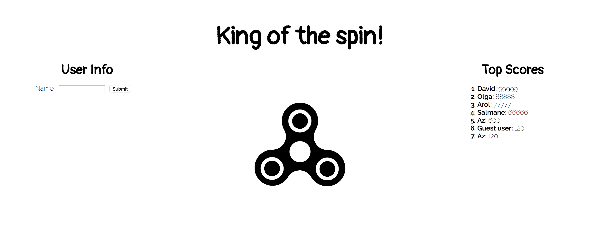
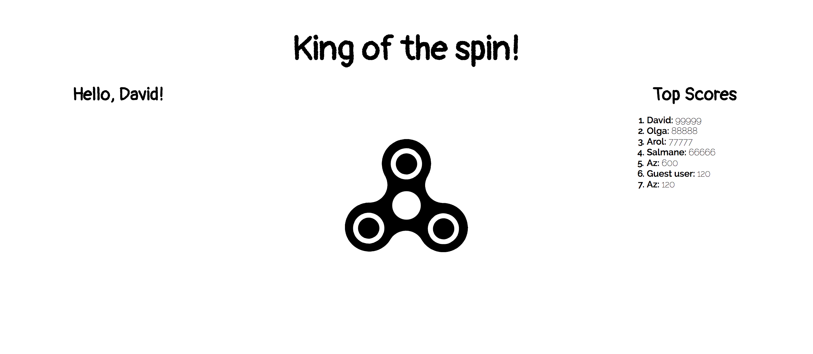

# King of the Spin!

Client side source code for fidget spinner project - King of the spin!




### Tech Stack
#### Front End
- React JS
- GSAP
#### Back End
- Express JS
- Mongoose (MongoDB)

### Installation
0. Download repo and install server side dependencies of King of the spin! project.
```sh
$ git clone https://github.com/casvil/fidget-spinner-server.git
$ npm install
```

1. Download and install repo in your local machine
```sh
$ git clone https://github.com/casvil/fidget-spinner-client.git
```

2. Install all the dependencies
```sh
$ npm install
```

3. Run the server (port 3001 by default while running server side on port 3000)
```sh
$ npm start
```
